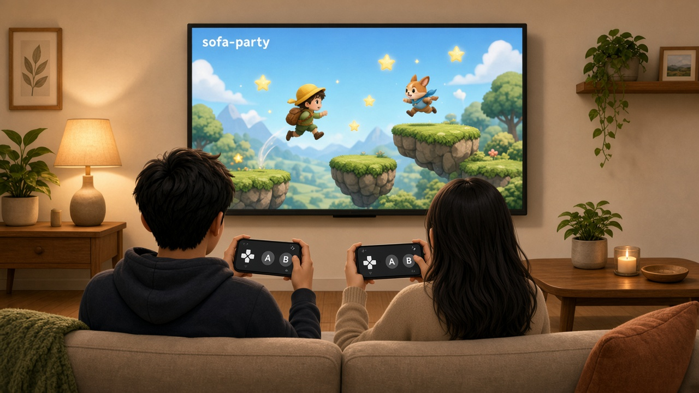

# 沙发派对

在家里的 Wi-Fi 上，用一台电脑当主机。电视、手机、平板打开浏览器就能一起玩小游戏p。



## 怎么玩

1. 在电脑上启动本服务，屏幕上会弹出主页面。
2. 手机扫页面上的二维码，进入游戏大厅。
3. 如果游戏支持大屏显示，可以在电视浏览器输入大屏地址，或者把电脑用 HDMI 接到电视上，在管理页点「本机当大屏」。
4. 大厅里能看到大屏是否连上、谁已经进来、装了哪些游戏。随便谁点一款，大家一起开始。

游戏有如下显示类型：

- **每人一屏**：画面在各自手机上，适合没有电视或不需要大屏的情况。
- **一块大屏，手机当手柄**：画面只在大屏上，手机充当手柄。

## 目前游戏大厅包含的游戏（持续更新完善中...）：


| 游戏               | 玩法             | 人数  |
| ---------------- | -------------- | --- |
| 接住它 `catch-drop` | 大屏掉东西，手机左右移动去接 | 2～8 |
| 柱上对射 `bow-duel`  | 两人手机横屏对射       | 2   |


## 欢迎一起开发小游戏！！！

本服务可以理解为一台虚拟的"小霸王主机"，你可以借助AI开发自己的游戏卡带，把接入规范 [game-dev.md](docs/game-dev.md) 丢给AI工具，描述你的游戏内容玩法即可。

## 服务框架开发

需要 [Bun](https://bun.sh)。

```bash
bun install
bun run dev
```

主机监听 `0.0.0.0:8080`，开发时会把外壳页面代理到 Vite（`127.0.0.1:5173`）。


| 页面       | 地址                             |
| -------- | ------------------------------ |
| 加入（手机）   | `http://<电脑局域网地址>:8080/`       |
| 大屏（电视手输） | `http://<电脑局域网地址>:8080/screen` |
| 管理（本机）   | `http://127.0.0.1:8080/admin`  |


常用命令：


| 命令                | 作用                                |
| ----------------- | --------------------------------- |
| `bun run dev`     | 同时启动主机和外壳开发服务                     |
| `bun run start`   | 只启动主机。外壳需要事先 `bun run build`      |
| `bun run test`    | 跑主机测试                             |
| `bun run build`   | 构建外壳，并生成 `/sdk/game.js`           |
| `bun run compile` | 在 build 之后打成单文件 `dist/sofa-party` |


端口可用环境变量 `PORT`，或启动参数 `--port=8080`。数据目录默认是仓库下的 `data/`（不进 Git）；要用别的工作目录，设置 `FAMILY_GAME_DIR`。

## 目录

```
apps/host/          主机进程：HTTP、WebSocket、档案、存档、装游戏
apps/web/           外壳页面：加入、大厅、大屏、管理
packages/protocol/  前后端共用的消息和 API 类型
packages/sdk/       给游戏网页用的 SDK
games/              已安装的游戏
docs/               需求、框架和游戏接入说明
```

游戏规则不写在主机里。没带 `server.js` 的游戏，由点开始的那位玩家的页面计算；带了 `server.js` 的，在主机工作线程里计算。脚本出错只结束这一局。

## 文档

- [需求说明](docs/requirements.md)
- [服务框架](docs/framework.md)
- [小游戏接入](docs/game-dev.md)
- [游戏模块约定](docs/game-module.md)


## 许可证

[Apache License 2.0](LICENSE)